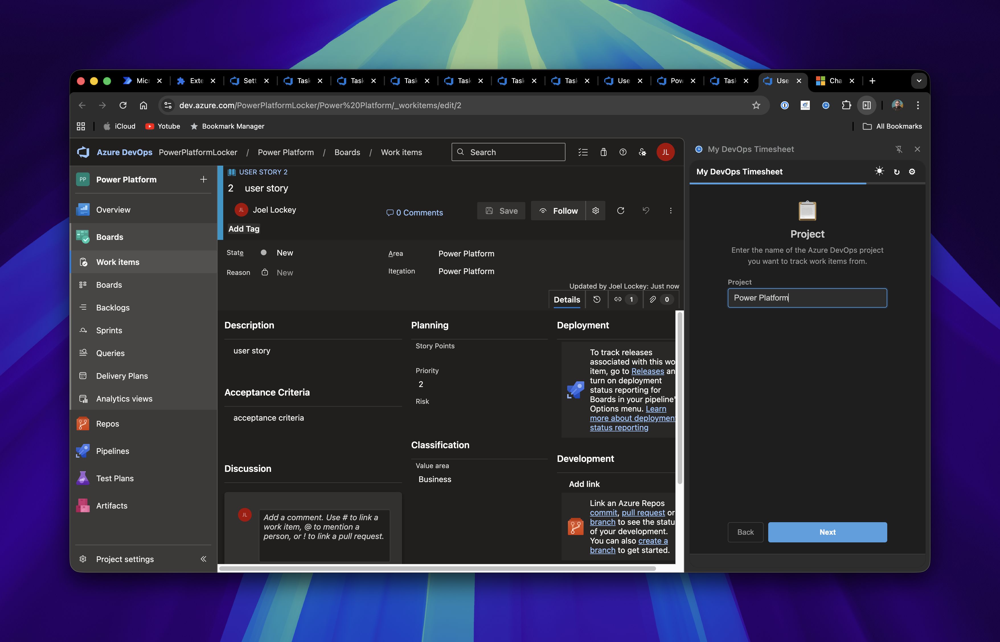

<p align="center">
  
</p>

<h1 align="center">My DevOps Timesheet</h1>

<p align="center">
  A Chrome side panel extension for viewing and editing Azure DevOps work item effort hours — right from your browser.
</p>

---

## Screenshots

| Work Items (Dark Mode) | Expanded Details |
|---|---|
|  |  |

## Features

- **Side panel UI** — opens alongside your current tab, no context switching
- **Inline editing** — click Remaining or Completed hours to update directly, saves to Azure DevOps instantly
- **Keyboard navigation** — Tab, Shift+Tab, and arrow keys to move between editable cells
- **Expand details** — click the arrow on any card to see State, Type, Priority, Assigned To, Iteration, Area, and Description
- **Double-click to open** — double-click a card to open the work item in Azure DevOps
- **Search** — filter work items by ID or title
- **Filter by type & iteration** — quickly narrow down to Tasks, Bugs, Stories, etc.
- **Colour coding** — green/amber/red/blue indicators based on remaining hours vs estimate
- **Dark mode** — toggle between light and dark themes, preference is saved
- **Hover tooltips** — hover over any card for a quick summary of all fields
- **PAT authentication** — securely stored in Chrome sync storage

## Installation

1. Clone or download this repository
2. Open `chrome://extensions/` in Chrome
3. Enable **Developer mode** (top right)
4. Click **Load unpacked** and select the `devops-timesheet` folder
5. Pin the extension by clicking the puzzle piece icon in the toolbar and pinning **My DevOps Timesheet**

## Setup

After installation, click the extension icon in the toolbar to open the side panel. A setup wizard will guide you through connecting to your Azure DevOps project.

### Step 1 — Welcome

The wizard offers two ways to get started:
- Click **Get Started** to enter your details step by step
- **Or** paste your Azure DevOps URL (e.g. `https://dev.azure.com/my-org/my-project`) to auto-fill the organization and project, skipping straight to the PAT step


> **URL shortcut:** Copy any URL from your Azure DevOps browser tab and paste it into the URL field. The extension will extract the org and project for you.


### Step 2 — Organization

Enter your Azure DevOps organization name. This is the part after `dev.azure.com/` in your URL.


### Step 3 — Project

Enter the name of the Azure DevOps project you want to track work items from.



### Step 4 — Access Token

Create a Personal Access Token (PAT) and paste it in. The wizard includes an expandable guide if you need help creating one.


#### Creating a PAT

1. Go to `https://dev.azure.com/{your-org}/_usersettings/tokens`
2. Click **New Token**
3. Give it a name and set an expiration date
4. Under **Scopes**, select **Work Items → Read & Write**
5. Click **Create** and copy the token
6. Paste the token into the wizard and click **Save & Connect**

Your work items will load automatically. Settings are synced across your Chrome browsers via `chrome.storage.sync`.

## Usage

- **Edit hours** — click any Remaining or Completed value, type a new number, press Enter
- **Keyboard navigation** — use Tab/Shift+Tab to move between cells, arrow keys to navigate across cards
- **Expand details** — click the triangle arrow next to the ID to reveal full work item details
- **Expand/Collapse all** — use the toolbar button to toggle all detail panels at once
- **Open in DevOps** — double-click a card to open it in a new tab
- **Search** — type in the search box to filter by ID or title
- **Filter** — use the Type and Iteration dropdowns in the toolbar
- **Refresh** — click the refresh button in the header to reload work items
- **Dark mode** — click the moon/sun icon in the header
- **Settings** — click the gear icon to change org, project, or PAT

## Tech Stack

- **Manifest V3** Chrome Extension
- Plain HTML / CSS / JavaScript — no build tools
- Azure DevOps REST API (WIQL + Work Items)

## File Structure

```
manifest.json       Chrome extension manifest
background.js       Opens side panel on toolbar icon click
sidepanel.html      Side panel markup
sidepanel.css       Styles with light/dark mode
sidepanel.js        State machine, API calls, rendering, inline editing
icons/              Extension icons (16, 48, 128px)
```

## License

MIT
